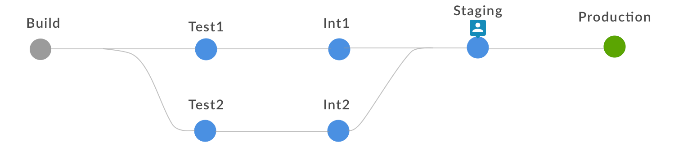
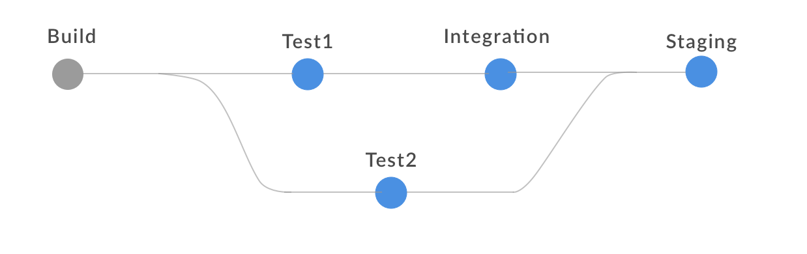

# Flows and plumber

## Fork and join multi parallel phases

The phase diagram would look like: 



The plumber script:
```
plumber {

    phase {
        name 'Build'
        action {
            script 'echo hello'
        }
    }

    phase {
    	name "Test1"
        action {
            script 'echo hello_again'
        }
        after 'Build'
    }

    phase {
    	name "Test2"
        action {
            script 'echo hello_again'
        }
        after 'Build'
    }

    phase {
    	name "Int1"
        action {
            script 'echo hello_again'
        }
        after 'Test1'
    }
    
    phase {
    	name "Int2"
        action {
            script 'echo hello_again'
        }
        after 'Test2'
    }    


    phase {
        name 'Staging'
        after 'Int1' 'Int2'
        action {
            input 'All good to go?'
        }
    }
    
    
    phase {
        name 'Production'
        after 'Staging'
        action {
            script 'deploy'
        }
    }
    
}
```


## Another view of parallel  




```
plumber {

    phase {
        name 'Build'
        action {
            script 'echo hello'
        }
    }

    phase {
    	name "Test1"
        action {
            script 'echo hello_again'
        }
        after 'Build'
    }

    phase {
    	name "Test2"
        action {
            script 'echo hello_again'
        }
        after 'Build'
    }

    phase {
    	name "Integration"
        action {
            script 'echo hello_again'
        }
        after 'Test1'
    }


    phase {
        name 'Staging'
        after 'Test2' 'Integration'
        pipeline {
            // embedded pipeline block
            withEnv(["FOO=bar"]) {
                echo "FOO is ${env.FOO}"
            }
        }
    }
    

    
}
```
